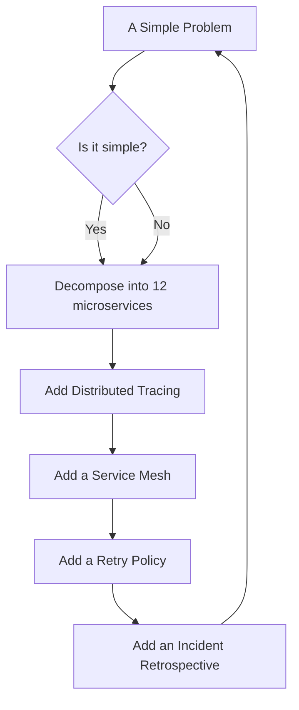

<!-- GENERATED ARTIFACT — do not hand-edit. Source of truth: profile/sections/*.md. Redeployed by .github/workflows/build-readme.yml -->

<div align="center">

<a href="https://srvcs.cloud"></a>

# ☁️ [srvcs.cloud](https://srvcs.cloud) ☁️

### **Building focused, composable services for modern distributed systems.**

_One concern. One service. One deployment pipeline._

<br/>


</div>

---

> ### 🚀 _"We took a function and gave it a runtime boundary, a SLA, and a sense of self."_
>
> — Internal architecture review, since archived

---

## 🧩 The Philosophy

We reject the **false tradeoff** between simplicity and complexity.

With sufficient abstraction, teams can have **both.** ✨



---

## ⚡ Core Capabilities

| Capability | Description | Necessary? |
|------------|-------------|:----------:|
| 🎯 **Single-purpose APIs** | Narrowly scoped operational primitives | ❓ |
| 📦 **Cloud-native delivery** | Containers, automation, and unnecessary confidence | ✅ |
| 👁️ **Observable-by-default** | Logs, metrics, traces, health checks, and existential dread | ✅ |
| 🛰️ **Independent deployability** | For workloads that previously fit inside a function | ❌ |
| 🏢 **Enterprise readiness** | For tasks that should not require enterprise readiness | 🤷 |

---

## 🏗️ What Every Service Includes

<div align="center">

| ✅ OpenAPI Docs | ✅ Containerized Runtime | ✅ Health Endpoints |
|:---:|:---:|:---:|
| **✅ Structured Logging** | **✅ Metrics Support** | **✅ CI/CD Workflows** |
| **✅ Deployment Manifests**  | **✅ Imposter Syndrome** | **✅ Technical Debt** |

</div>

---

## 🛡️ Reliability

Our services are engineered for **high availability across trivial workloads.**

No operation is too small for:

- ↔️ Horizontal scaling
- 🔍 Distributed tracing
- 🔁 Retry policies
- 📉 Graceful degradation
- 📝 Incident retrospectives
- 🌍 Multi-region aspirations

---

## 🎯 Mission

<div align="center">

### _To decompose simple problems into focused, composable, independently deployable solutions._

</div>

---

## 📍 Location

```
us-east-1
```

<sub>(occasionally us-east-1, also us-east-1)</sub>

---

<div align="center">

**[srvcs.cloud](https://srvcs.cloud)** · Made with 🩸 and far too many YAML files

</div>
