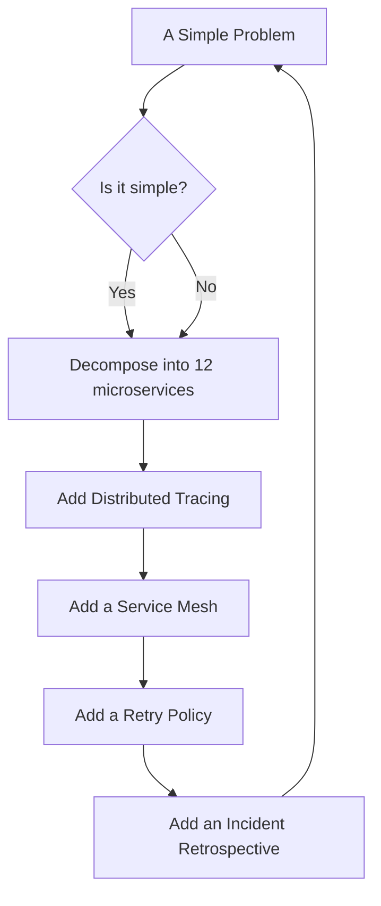

## 🧩 The Philosophy

We reject the **false tradeoff** between simplicity and complexity.

With sufficient abstraction, teams can have **both.** ✨

```mermaid
graph TD
    A[A Simple Problem] --> B{Is it simple?}
    B -->|Yes| C[Decompose into 12 microservices]
    B -->|No| C
    C --> D[Add Distributed Tracing]
    D --> E[Add a Service Mesh]
    E --> F[Add a Retry Policy]
    F --> G[Add an Incident Retrospective]
    G --> A
```
